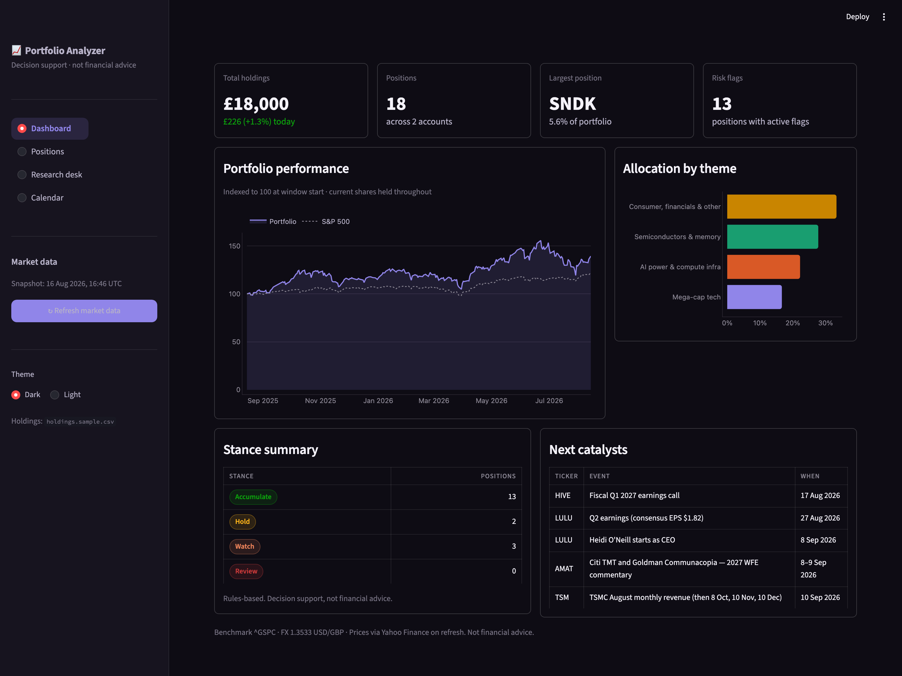

# Stock Portfolio Analyzer

[](https://github.com/caspar-cpu/stock-portfolio-analyzer/actions/workflows/ci.yml)

A Streamlit decision-support app for a real multi-account equity portfolio. It reads a
holdings CSV and a research log, prices every position against a market snapshot, and
scores each one with a transparent rules engine so you can see *why* a name reads as
Accumulate / Hold / Watch / Review — not just that it does.

Built for the Gen Academy "Mastering Agentic AI" Week 1 vibe-coding project (Path A),
and kept deliberately usable as an ongoing tool afterwards.

> **Not financial advice.** Every score is a rules-based reading of public data. It is a
> lens for your own judgement, not a recommendation.



## What it does

- **Dashboard** — total value, day change, largest position, active risk-flag count;
  portfolio performance indexed to 100 vs the S&P 500 on one axis; allocation by theme;
  a stance summary and the next five catalysts.
- **Positions** — every holding with live price (USD) and value (GBP), weight, day move,
  decision score and stance, filterable by account and sortable by value/weight/score/day.
- **Research desk** — a per-position deep dive: the decision score broken into its five
  weighted components, live technicals (price, RSI, 50/200-day moving averages, distance
  off the 52-week high), analyst consensus and targets from the research log, active
  flags, and the position's own catalyst dates.
- **Calendar** — every dated catalyst from the research log, nearest first, with an exact
  countdown for firm dates and an "approx" marker for soft ones.
- **Light / dark themes** and an explicit **Refresh** button — the app never hits the
  network on its own (see [Data model](#data-model)).

## The decision score

Each position with research coverage gets a 0–100 score, a weighted blend of five
components. The weighting and thresholds are deliberately explicit and unit-tested
(`core/signals.py`, `tests/test_signals.py`):

| Component | Weight | Reads from | 100 means |
|---|---|---|---|
| Trend | 25% | snapshot | above both the 50- and 200-day moving average |
| Momentum | 15% | snapshot | RSI(14) in the constructive 45–70 band |
| Street view | 20% | research log | analyst consensus of Strong Buy |
| Valuation headroom | 20% | research log | ≥30% upside to average target, cheap PEG |
| Risk drag | 20% | both | no elevated short interest or thinning volume |

Scores map to a stance by band: **≥70 Accumulate · ≥55 Hold · ≥40 Watch · <40 Review.**

On top of the score, a position can raise **flags** that don't feed the number but matter
for sizing: single-name concentration (≥12%), theme crowding (≥25%), an earnings/event
inside 14 days, or a battleground level of short interest (≥15%).

Positions with no research coverage show no score — technicals alone would give a false
sense of rigour.

## Data model

Three inputs, all under `data/`:

| File | What it is | In git? |
|---|---|---|
| `holdings.csv` | your real positions (`account,ticker,name,shares,value_gbp_snapshot`) | no — gitignored |
| `holdings.sample.csv` | a shipped example (same shape, ~£100k, identical weights) | yes |
| `research.json` | analyst consensus, themes, standing observations, catalyst dates | yes |
| `snapshot.json` | the last market snapshot the Refresh button wrote | no — gitignored |

The app prefers your private `holdings.csv` and falls back to `holdings.sample.csv`, so a
fresh clone runs immediately with the sample.

**Market data is pull, not live.** Nothing fetches on load. The **Refresh** button is the
only network call: it pulls one year of daily closes for every ticker plus the S&P 500 and
GBP/USD from Yahoo Finance, computes the indicators once, and writes `data/snapshot.json`.
Every screen reads from that file, so the app is fast, works offline, and never rate-limits
itself. Positions the fetch can't price fall back to the value recorded in the holdings CSV
and are marked accordingly.

## Running it

```bash
cd stock-portfolio-analyzer
python3 -m venv .venv && source .venv/bin/activate
pip install -r requirements.txt
streamlit run app.py
```

Then click **Refresh market data** once in the sidebar to pull live prices.

To analyse your own portfolio, drop a `data/holdings.csv` with the same columns as the
sample, and extend `data/research.json` with a matching entry per ticker.

## Development

```bash
pip install -r requirements-dev.txt
ruff check .      # lint
pytest -q         # 38 tests, all pure logic (no network, no Streamlit runtime)
```

## Layout

```
app.py                 entry point: sidebar, routing, caching, refresh
theme.py               design tokens + CSS for light/dark
core/
  market.py            snapshot fetch + technical indicators
  portfolio.py         holdings load, valuation, history
  research.py          research log + catalyst access
  signals.py           the scoring engine
ui/
  format.py            value formatting, markdown escaping, stance chips
  charts.py            Plotly figure builders
  views.py             the four screens
data/                  holdings (sample), research log
tests/                 pytest suite for the core logic
```

## Notes on the palette

The chart colours are not arbitrary. The eight categorical hues were run through a
colour-vision-deficiency validator for adjacent-pair separation in *both* light and dark
against the actual chart surfaces; the slot order is the safety mechanism and shouldn't be
reordered without re-validating. Status colours (Accumulate/Hold/Watch/Review) are a
separate reserved set that never doubles as a series colour.
